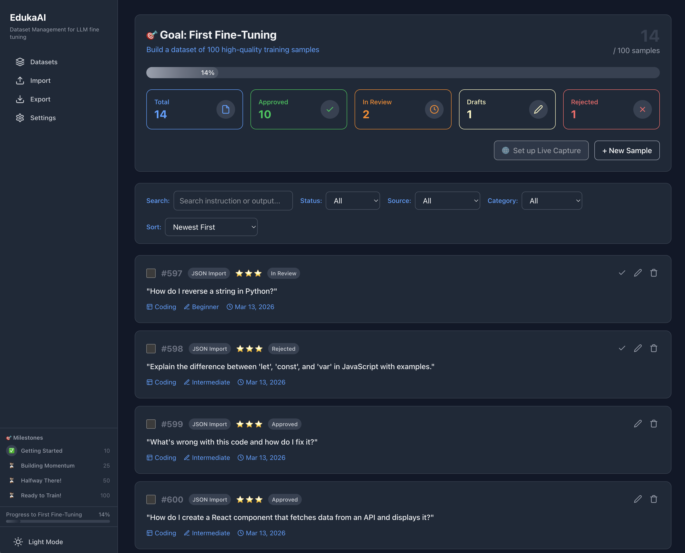

# EdukaAI

> **Privacy-first, simple training data management for LLM fine-tuning**

[](https://badge.fury.io/js/@elgap%2Fedukaai)
[](https://github.com/elgap/edukaai/actions/workflows/ci.yml)
[](https://www.npmjs.com/package/@elgap/edukaai)
[](https://opensource.org/licenses/MIT)

EdukaAI is a local, self-hosted web application designed to help you **collect, organize, and manage training data** for fine-tuning Large Language Models (LLMs). Built for privacy-conscious developers and AI enthusiasts who want full control over their data.



## 🎯 Why EdukaAI?

**Privacy First**: Your data never leaves your machine. Local SQLite database, no cloud dependencies, no data tracking.

**Beginner Friendly**: Clean, intuitive interface. No complex setup. Start collecting training samples in minutes.

**Powerful for Experts**: Bulk operations, import/export in multiple formats, fine-grained status tracking, and goal management.

**Zero Configuration**: Works out of the box. Just run and start building your dataset.

## ✨ Key Features

### 📊 **Dataset Management**

- Create multiple datasets for different fine-tuning projects
- Set custom goals and track progress with visual indicators
- Organize datasets by purpose (coding, creative writing, Q&A, etc.)

### 📝 **Training Sample Management**

- **Core Fields**: Instruction, Input, Output, System Prompt
- **Rich Metadata**: Category, Difficulty, Quality Rating (1-5 stars), Tags, Notes
- **Status Tracking**: Draft → In Review → Approved/Rejected workflow
- **Bulk Operations**: Select multiple samples and approve, categorize, or delete

### 📥 **Import & Export**

- **Import**: JSON files (Alpaca, ShareGPT formats), sample datasets
- **Export**: Multiple formats compatible with major training platforms
  - Alpaca (JSON)
  - ShareGPT (JSON)
  - Raw JSON
  - JSONL
  - CSV

### 🎨 **Workflow Features**

- **Keyboard Shortcuts**: Ctrl+Enter to save, Esc to cancel
- **Progress Tracking**: Milestones (10%, 25%, 50%, 100%) with visual indicators
- **Sample Navigation**: Previous/Next buttons to quickly review samples
- **Filtering**: By status, category, source, quality rating

### 🔒 **Privacy & Security**

- **100% Local**: SQLite database stored on your machine
- **No Cloud**: No internet connection required after installation
- **No Tracking**: Zero analytics, zero data collection
- **Open Source**: Full transparency

## 🚀 Quick Start

### NPM Package Installation (Recommended)

The easiest way to use EdukaAI is via the npm package:

#### Option 1: npx (No Installation)
```bash
npx @elgap/edukaai
````
#### Option 2: Global Install

```bash
npm install -g edukaai
edukaai
```

Then open [http://localhost:3000](http://localhost:3000) in your browser.

## 💻 CLI Reference

EdukaAI provides a powerful CLI for managing your training data workflow:

### Available Commands

| Command               | Description                      |
|-----------------------|----------------------------------|
| `edukaai`             | Start server                     |
| `edukaai reset`       | Reset database with confirmation |
| `edukaai reset --force` | Force reset without confirmation 
| `edukaai clean`       | Alias for reset                  |
| `edukaai help`        | Show help and available commands |

More to some soon. Stay tuned!

### Environment Variables Supported:

- EDUKAAI_HOST (default: localhost)
- EDUKAAI_PORT (default: 3030)
- EDUKAAI_DATA_DIR (default: ~/.edukaai)
- DATABASE_URL (default: ./data/edukaai.db)

## 📖 Usage Guide

### Creating Training Samples

Each training sample represents one example for your model:

```
Instruction: "Explain the concept of machine learning in simple terms"
Input: "" (optional - leave empty for direct instruction)
Output: "Machine learning is like teaching a computer to recognize patterns..."
System Prompt: "You are a helpful AI assistant" (optional)
Category: "explanation"
Quality: ⭐⭐⭐⭐⭐
```

### Dataset Organization

Think of datasets as **projects**:

- 🎯 **Coding Examples**: Programming problems and solutions
- 🎯 **Creative Writing**: Story prompts and completions
- 🎯 **Q&A Pairs**: Question-answer training data
- 🎯 **Roleplay**: Character-based conversations

### Quality Workflow

Track your samples through the review process:

- 📝 **Draft**: Work in progress, not ready
- 👀 **In Review**: Needs review before approval
- ✅ **Approved**: Ready for training
- ❌ **Rejected**: Not suitable (won't be exported)

### Importing Existing Data

Have training data in JSON format?

```bash
# Prepare your JSON file (Alpaca format)
[
  {
    "instruction": "Your instruction here",
    "input": "Optional input",
    "output": "Expected output",
    "category": "coding"
  }
]
```

Then use the Import page to upload and automatically categorize.

## 💻 For Developers

### Tech Stack

- **Frontend**: Vue 3 + Nuxt 4 + Tailwind CSS
- **Backend**: Nuxt 4 API routes (Server-side rendering)
- **Database**: SQLite (local file)
- **ORM**: Drizzle ORM

### Project Structure

```
edukaai/
├── app/                 # Nuxt 4 application
│   ├── components/      # Vue components
│   ├── layouts/         # Page layouts
│   ├── pages/           # Routes (index, samples, import, export)
│   └── components/       # Reusable UI components
├── server/             # Backend API
│   ├── api/            # REST endpoints
│   ├── db/             # Database schema & migrations
│   └── utils/          # Server utilities
├── bin/                # CLI scripts
└── package.json
```

### Building from Source

```bash
# Clone the repository
git clone https://github.com/yourusername/edukaai.git
cd edukaai

# Install dependencies
npm install

# Run in development mode
npm run dev

# Optionaly, Build for production
npm run build
npm run start
```

### CLI Commands

```bash
# Reset database (with migrations)
npm run db:reset

# Generate sample data
npm run sample:import
```

## 🤝 Contributing

Contributions are welcome. We will publish contribution guidelines soon.

## 📄 License

MIT License - see [LICENSE](LICENSE) file for details.

## 🙏 Acknowledgments

- Inspired by the need for simple, private LLM training tools
- Built with [Nuxt](https://nuxt.com/), [Vue](https://vuejs.org/), and [Tailwind](https://tailwindcss.com/)
- Icons by [Lucide](https://lucide.dev/)

---

**Built with ❤️ for the AI community**

[⬆ Back to Top](#edukaai)
