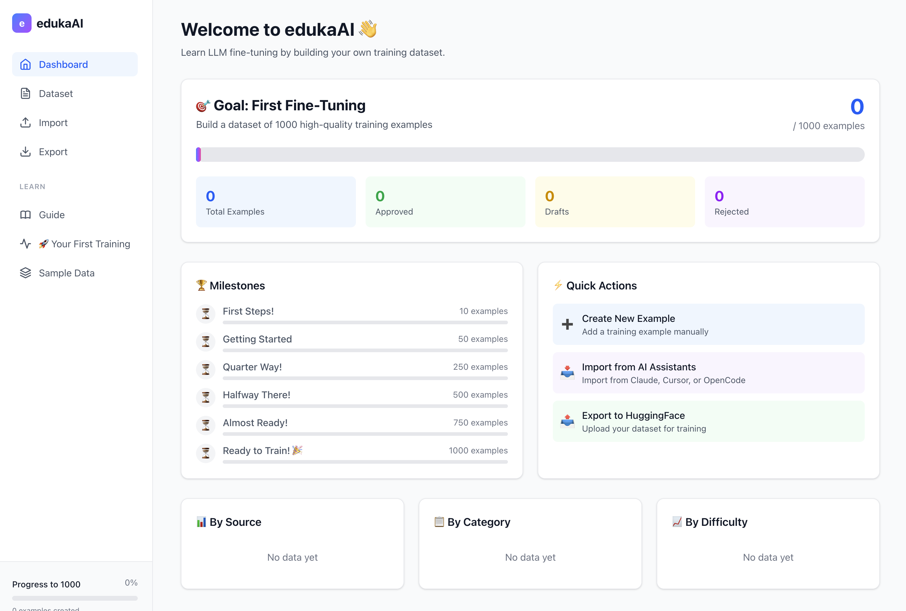

[](https://badge.fury.io/js/@elgap%2Fedukaai)
[](https://github.com/elgap/edukaai/actions/workflows/ci.yml)
[](https://www.npmjs.com/package/@elgap/edukaai)
[](https://opensource.org/licenses/MIT)

# edukaAI 🎓

> Create training datasets for LLM fine-tuning with zero setup.

**edukaAI** is the simplest way to create your first AI training dataset. No cloud services, no complex configuration—just run one command and start building.



## ✨ Features

- **🎯 Zero Setup** - One command, start immediately
- **📝 Form-based Creation** - All fields explained with tooltips
- **📥 Import from AI Assistants** - Claude, Cursor, OpenCode, ChatGPT, Copilot
- **📤 Multiple Export Formats** - Alpaca, ShareGPT, JSONL, CSV
- **📊 Progress Tracking** - Visual goal to 1000 examples
- **🔒 100% Local** - Your data never leaves your machine
- **🎓 Educational** - Learn while you build

## 🚀 Quick Start

### Option 1: npx (No Installation)

```bash
npx @elgap/edukaai
```

### Option 2: Global Install

```bash
npm install -g @elgap/edukaai
edukaai
```

Then open http://localhost:3000 in your browser.

## 📖 What You Can Do

### 1. Create Training Examples

Build dataset examples with all fields explained:

- **Instruction** - The main question or task
- **Input** - Additional context (optional)
- **Output** - The ideal AI response
- **System Prompt** - AI personality/behavior
- **Category & Tags** - Organization
- **Quality Rating** - 1-5 stars

### 2. Import from AI Assistants

Import conversations from:

- Claude Code
- Cursor Editor
- OpenCode
- ChatGPT
- GitHub Copilot

### 3. Export for Training

Export your dataset in formats compatible with:

- Hugging Face
- Axolotl
- LLaMA-Factory
- Custom training pipelines

Formats: Alpaca, ShareGPT, JSONL, JSON, CSV

### 4. Track Progress

- Visual progress bar (0/1000 goal)
- Milestone achievements
- Statistics by category and quality

## 🛠️ Tech Stack

| Layer        | Technology          |
| ------------ | ------------------- |
| **Frontend** | Vue 3 + Nuxt 4      |
| **Backend**  | Nuxt 4 API Routes   |
| **Database** | SQLite (file-based) |
| **ORM**      | Drizzle ORM         |
| **Styling**  | Tailwind CSS        |

## 📁 Data Location

Your data is stored locally in your home directory:

- Database: `~/.edukaai/data.db`
- Config: `~/.edukaai/config.json`

## ⚙️ Configuration

### Environment Variables

```bash
EDUKAAI_PORT=3000         # Server port
EDUKAAI_HOST=localhost    # Server host
EDUKAAI_DATA_DIR=~/.edukaai  # Data directory
```

### Command Line Options

```bash
edukaai --port 8080       # Use custom port
edukaai --host 0.0.0.0    # Allow external access
```

## 🎓 Learning Path

1. **Create 10 examples manually** - Learn the format
2. **Import from your AI conversations** - Build dataset quickly
3. **Export to training format** - Ready for fine-tuning
4. **Train your first model** - See results!
5. **Iterate and improve** - Add more quality data

## 🤝 Contributing

Contributions welcome! Please read our contributing guidelines.

## 📄 License

MIT License - see [LICENSE](LICENSE) file

---

**Ready to train your first AI model?**

```bash
npx @elgap/edukaai
```

🚀
